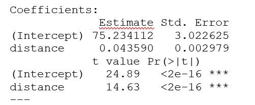

# Flight Route Price Prediction (Regression Analysis)

## Overview

This project applies linear and quadratic regression models to analyze the relationship between flight distance and ticket price.

Using R Studio, the objective was to evaluate whether distance significantly predicts airfare pricing and assess whether a nonlinear model improves explanatory power.

---

## Business Context

Airline pricing strategies depend on route distance, demand, and competition.

This analysis focuses on routes where Southwest Airlines is the market leader and investigates:

- Does ticket price increase linearly with distance?
- Does a quadratic relationship better explain pricing behavior?
- Which model provides stronger predictive performance?

---

## Methodology

### 1. Data Preparation
- Filtered routes where Southwest Airlines is the dominant carrier
- Extracted distance and price variables
- Performed regression analysis in R

### 2. Model 1: Simple Linear Regression
Price = β₀ + β₁(Distance)

### 3. Model 2: Quadratic Regression
Price = β₀ + β₁(Distance) + β₂(Distance²)

---

## Results

### Linear Regression Summary

### Scatter Plot with Linear Fit

### Quadratic Model Fit

The quadratic model improved model fit compared to the simple linear regression, indicating that airfare pricing may exhibit nonlinear characteristics over distance.

---

## Tools Used

- R Studio
- Linear Regression
- Quadratic Regression
- Statistical Model Interpretation

---

## Repository Structure
